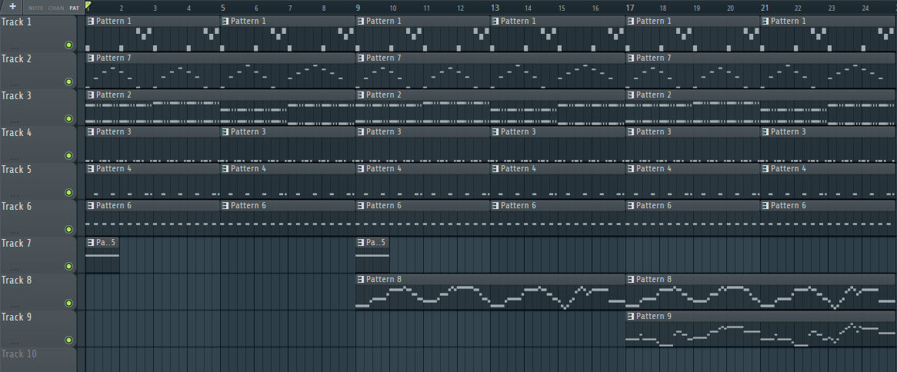

Hello world! This week was a juicer, since I'm now more acclimated to my role for this class. Let's recap.

## I'm an engineer

As I mentioned last time, I'm gonna be the general sound guy for everyone. I've since met with each group individually during class time and noted down what kind of sound effects they need at the moment in their respective Discord channels. The main challenge I see going forward is trying my best not to reuse sound effects between projects; footsteps are a common need, though differentiating footsteps (especially between ones walking on the same material) will require a finer detailed approach.

My main work this week was getting some basic gameplay soundtrack up and running for Elemental Dungeon, which can be seen below. It was well recieved by the group, which is good news for me; while I don't mind going back to the drawing board for music at this stage of development, it certainly helps to be able to *develop* an idea sooner rather than later.

<!--
<audio controls>
    <source src="./boss_test_1.mp3" type="audio/mpeg">
If you're reading this the audio didn't work.
</audio>
-->
Couldn't get the audio player working on the blog. I'll be asking Dr. Faas about that later...

I also did some more digging into peer-to-peer multiplayer for Godot, but I'm still figuring out exactly how it works, alongside the laptop I bring to class not running my testing well at all.

## Practical problems

The main blocker for me this week was time. My other classes are giving me quite a bit to work on, so I couldn't dedicate the time I wanted to these projects. Despite the limitations there, I got the music above done relatively quickly, taking a bit over half the time I expected it to.

My communication could also use some work in terms of frequency I believe. I've been mostly posting only when I have something *done* rather than when I have something *in progress*, so it may help me to be more... trigger-happy? When posting my WIPs. It will be challenging given the workload my other classes have provided me, but it should be doable.

That's about all. Didn't have time to figure out fonts but images are working so that's great! Hopefully I'll have even *more* to show next week.

