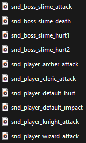

How's it going? I have a good topic for this week, so let's get straight into it.

## Keeping everything organized

Of course, keeping your files organized on a game project is imperative, but what do you do when you have a lot of assets? Naming all of the sprites along the lines of "`sprite01.png`, `sprite02.png`, `sprite03.png`" is inefficient, often indecipherable and always banal. So instead, you must name the files with purpose! It's best to find a balance between descriptive and short while keeping it easily readable. Below is the system I've used for the sound effects I've made this week.

</img>

These are easily readable from left to right! Dissecting each part seperated by the underscores, we start with `snd` to denote that this is a **s**ou**nd** effect. (Similarly, I will be using `mus` for **mus**ic.) Afterward, it's either `player` or `boss`, showing what group of functions the sound belongs to. Similar groups in the future could be stuff like `enemy`, `projectile` or `gui` depending on what's needed. After that, it's the specific object in the group, such as the individual player classes `knight` or `wizard`. Only after then do I put what the sound actually *is*; `attack` for when they do an attack, `hurt` for when they are hit by an attack, and so on.

Importantly, the sounds `snd_boss_slime_hurt1` and `snd_boss_slime_hurt2` use the aforementioned "bad" numbering, but it's excusable here since we have the upper layers of definition of what the sound is *and* because they are intended to be used interchangably for the same condition. Both are sounds that can play when the slime boss gets hurt.

## What are slime noises?

The slime noises were fun to make since slimes aren't an existing creature in our day to day lives. At least, as far as I know...

I ended up recording myself making some "squelching" noises into the microphone, then opening those up in my DAW and showering them in effects to the point where you can hardly tell it's a human making those sounds. The effects in question here were some pitch modulation, a good amount of reverb to give the sound more space, and a big vibrato-esque delay filter tied to a low-frequency modulator. The fun part about that last effect is that exporting the sound at different points in time resulted in an audible difference, since the LFO would be at different frequencies each export due to its constant cycling. That is precisely how I got the 2 boss-slime-hurt sounds!

## Other notes

I got sick for most of this week so the sound effect work was the extent of my efforts over the week. Next week expect more music talk; I'm going to be making a calm park theme for Creepy Crawlers at the very least.

Catch you in the next blog!