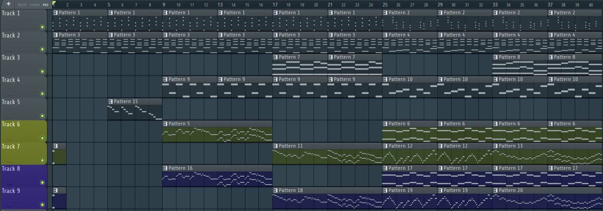

Heyo. I got a good topic for this week so let's get straight into it.

## Dynamic music

My main work for this week was creating a park theme for the team working on Creepy Crawlers. I was excited to take this on, as the more relaxed nature of the game lends itself to more relaxed music, which is not my usual caliber of soundtrack. Below is a screenshot of the track I composed.

</img>

After discussing with the team, I figured it would be a good idea to make the music dynamic depending on the day-night cycle in-game. Thus, the tracks marked in yellow are exclusive to the day variant of the song, whereas the tracks marked in blue are eclusive to the night variant. This results in three exported files, `mus_park_base` for the non-exclusive parts, `mus_park_day` for only those daytime parts and `mus_park_night` for the nighttime ones.

I thought creating dynamic music in Godot would have been more difficult due to needing to run several tracks in parallel, but I was delighted to figure out after some research that since Godot v4.3, there exists an AudioStreamSynchronized node that can play multiple tracks at once and have the volume of each individual stream edited with a simple function! This makes **vertical mixing** really easy.

For a bit of explanation, **vertical mixing** is the process of adding layers *on top of* a music track currently playing depending on the gamestate. An example can be found as far back as *Super Mario World* on the SNES, where the background music introduces additional drums while you're riding on a Yoshi. I am applying a similar technique here, though with three total layers instead of two and always keeping at least two of them playing at once; `mus_park_base` and the corresponding day or night layer.

From my research, there's also an AudioStreamInteractive node that can help with *horizontal* mixing, but that's a topic for another time. I am unsure if either of the games I am working on will require such a technique in their soundtracks, so it may not be necessary altogether.

## Time is against us

As usual, the main blocker was time. Last week was very busy due to my other class and club commitments. However, I'm confident that all of my necessary music and sound effect work for the semester will be done before the end of the semester. My only hope from there is that I am able to make *more* than just what is necessary, but we'll just have to see.

Catch you next week!